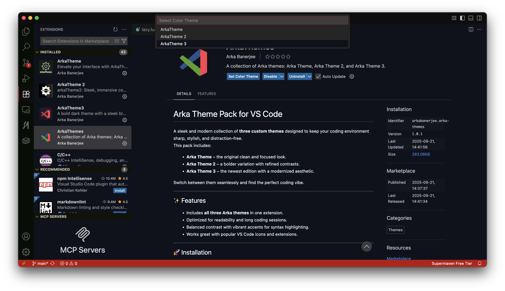
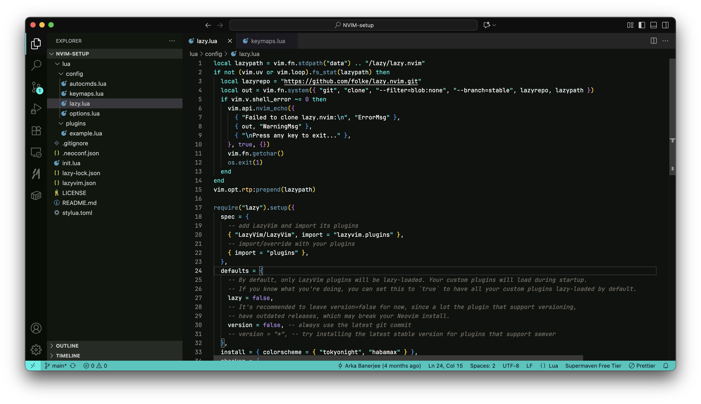
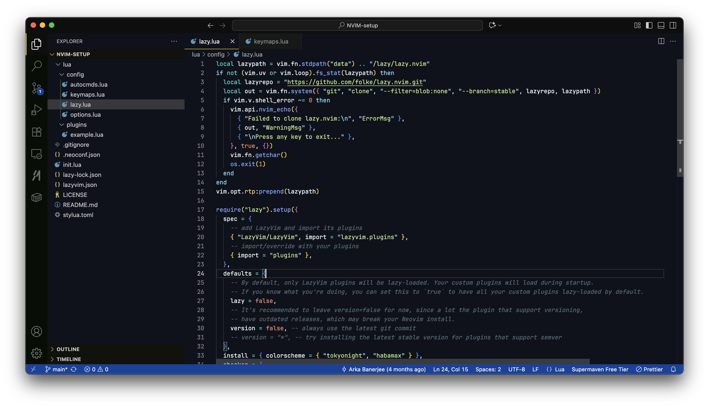
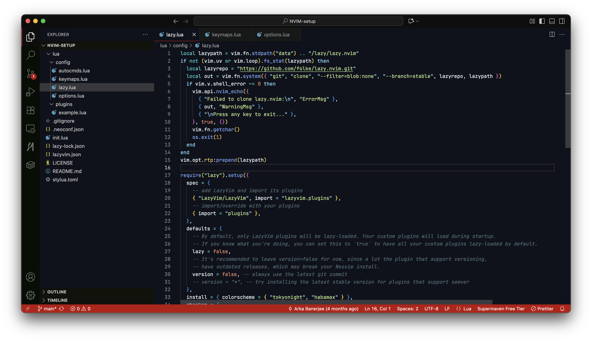

# Arka Theme Pack for VS Code

A sleek and modern collection of **three custom themes** designed to keep your coding environment sharp, stylish, and distraction-free.  
This pack includes:

- **Arka Theme 1** – the original clean and focused look.  
- **Arka Theme 2** – a bolder variation with refined contrasts.  
- **Arka Theme 3** – the newest edition with a modernized aesthetic.  

Switch between them seamlessly and find the perfect coding vibe.

---

## ✨ Features
- Includes **all three Arka themes** in one extension.  
- Optimized for readability and long coding sessions.  
- Balanced contrast with vibrant accents for syntax highlighting.  
- Works great with popular VS Code icons and extensions.  

---

## 🚀 Installation
1. Open **Extensions Marketplace** in VS Code (`Ctrl+Shift+X` or `Cmd+Shift+X` on Mac).  
2. Search for **Arka Theme Pack**.  
3. Click **Install**.  
4. Open the Command Palette (`Ctrl+Shift+P` or `Cmd+Shift+P`), then select:  
   - **Arka Theme**: Switch to Arka Theme.  
   - **Arka Theme 2**: Switch to Arka Theme 2.  
   - **Arka Theme 3**: Switch to Arka Theme 3.  
5. Enjoy your new coding experience!  

---
### Chosing the right theme
The Arka Theme Pack includes three themes, each with its own unique features and aesthetic. Choose the one that best suits your coding style and preferences.  



### Editor View

## ArkaTheme 1:




## ArkaTheme 2:




## ArkaTheme 3:




## ⚙️ Recommended Setup

To get the best look:

```jsonc
// settings.json
{
  "editor.fontFamily": "Fira Code, JetBrains Mono, Consolas, 'Courier New', monospace",
  "editor.fontLigatures": true,
  "workbench.iconTheme": "material-icon-theme",
  "workbench.colorTheme": "ArkaTheme 3",
  "window.titleBarStyle": "custom",
  "window.transparency": true // for supported systems/extensions
}
```

## 🧑‍💻 Contributing

Have suggestions? Open an [issue](https://github.com/thearkabanerjee/Arka-Themes/issues) or submit a PR.
Every improvement makes the theme better for all developers.


We will Include New Themes if we get enough feedback from you.


                        ⡏⠉⠛⢿⣿⣿⣿⣿⣿⣿⣿⣿⣿⣿⣿⣿⣿⣿⣿⣿⣿⣿⣿⡿⣿
                        ⣿⠀⠀⠀⠈⠛⢿⣿⣿⣿⣿⣿⣿⣿⣿⣿⣿⣿⣿⠿⠛⠉⠁⠀⣿
                        ⣿⣧⡀⠀⠀⠀⠀⠙⠿⠿⠿⠻⠿⠿⠟⠿⠛⠉⠀⠀⠀⠀⠀⣸⣿
                        ⣿⣿⣷⣄⠀⡀⠀⠀⠀⠀⠀⠀⠀⠀⠀⠀⠀⠀⠀⠀⠀⢀⣴⣿⣿
                        ⣿⣿⣿⣿⠏⠀⠀⠀⠀⠀⠀⠀⠀⠀⠀⠀⠀⠀⠀⠠⣴⣿⣿⣿⣿
                        ⣿⣿⣿⡟⠀⠀⢰⣹⡆⠀⠀⠀⠀⠀⠀⣭⣷⠀⠀⠀⠸⣿⣿⣿⣿
                        ⣿⣿⣿⠃⠀⠀⠈⠉⠀⠀⠤⠄⠀⠀⠀⠉⠁⠀⠀⠀⠀⢿⣿⣿⣿
                        ⣿⣿⣿⢾⣿⣷⠀⠀⠀⠀⡠⠤⢄⠀⠀⠀⠠⣿⣿⣷⠀⢸⣿⣿⣿
                        ⣿⣿⣿⡀⠉⠀⠀⠀⠀⠀⢄⠀⢀⠀⠀⠀⠀⠉⠉⠁⠀⠀⣿⣿⣿
                        ⣿⣿⣿⣧⠀⠀⠀⠀⠀⠀⠀⠈⠀⠀⠀⠀⠀⠀⠀⠀⠀⠀⢹⣿⣿
                        ⣿⣿⣿⣿⠃⠀⠀⠀⠀⠀⠀⠀⠀⠀⠀⠀⠀⠀⠀⠀⠀⠀⢸⣿⣿


## 📝 License
This project is licensed under the MIT License. See the [LICENSE](LICENSE) file for more information.